# 🎫 TicketSystem
### *The Enterprise-Grade Event Ecosystem*


---

## 🌌 The "Deep Cosmos" Experience

**TicketSystem** is not just a management tool; it is a high-performance visual engine designed for modern event orchestration. Built on a "Write-Through, Read-Through" caching architecture, it delivers **zero-latency** scans and **real-time** dashboard updates, wrapped in a stunning **Glassmorphic** interface.

### 🍱 The Bento Design Language
Our interface follows a strict **"Rainbow Bento"** philosophy: organized, modular, and beautiful.

| **Modules** | **Description** |
| :--- | :--- |
| **📊 Analytics Core** | Real-time occupancy tracking, velocity charts, and financial metrics displayed in translucent glass cards. |
| **☄️ Celestial Raffle** | A physics-based prize draw engine. Uses HTML5 Canvas to render starfields and shockwaves for a cinematic reveal. |
| **📱 Hyper-Scanner** | A standalone PWA-ready scanner that operates with optimistic UI updates for <100ms processing times. |
| **📨 Comm-Link** | Batch email processor with exponential backoff, template rendering, and targeted delivery. |

---

## 🏗️ System Architecture

### ⚡ Data Flow & Latency Strategy
We prioritize speed. The scanner gets an immediate "Green Light" from local cache while the backend asynchronously synchronizes with the cloud.

```mermaid
graph TD
    %% Nodes
    Scanner[📱 Smart Scanner]:::device
    Cache{⚡ In-Memory Cache}:::memory
    DB[(🔥 Cloud Firestore)]:::db
    Dash[🖥️ Admin Dashboard]:::react

    %% Flows
    Scanner -- "Scan QR" --> Cache
    Cache -- "Instant Valid (0ms)" --> Scanner
    Cache -.-> |"Async Write"| DB
    DB -- "Real-time Sync" --> Dash
    DB -- "Hydrate" --> Cache

    %% Styling
    classDef device fill:#fff3e0,stroke:#f57c00,stroke-width:2px,color:#e65100
    classDef memory fill:#e3f2fd,stroke:#2196f3,stroke-width:2px,color:#0d47a1
    classDef db fill:#eceff1,stroke:#455a64,stroke-width:2px,color:#263238
    classDef react fill:#f3e5f5,stroke:#ab47bc,stroke-width:2px,color:#4a148c
```



### 🌐 Network Topology
The system is designed to live anywhere—local venue WiFi, 4G cellular, or behind corporate firewalls—thanks to our **Smart Tunneling** layer.

```mermaid
graph LR
    User((Attendee))
    
    subgraph Venue ["📍 Venue Network"]
        Server[Node.js Host]
        LocalScan[Scanner A (Local)]
    end
    
    subgraph Cloud ["☁️ The Internet"]
        Ngrok[Ngrok Tunnel]
        RemoteScan[Scanner B (4G)]
    end
    
    User --> LocalScan
    User --> RemoteScan
    
    LocalScan -- "Local LAN (Fast)" --> Server
    RemoteScan -- "Secure Tunnel" --> Ngrok
    Ngrok --> Server
```

---

## 🚀 Key Features

### 1. The Celestial Raffle Engine 🎲
*   **Physics-Based:** Uses mass, velocity, and drag to simulate a lottery ball machine in a starfield.
*   **Queue Management:** "Grand Prize | iPhone 15" syntax allows specific prize ordering.
*   **Immersive Audio-Visuals:** Spring-loaded animations and particle effects built with Framer Motion.

### 2. Intelligent Gatekeeping 🛡️
*   **Optimistic Caching:** Scans are validated against RAM first. Database writes happen in the background.
*   **Double-Entry Prevention:** Atomic checks ensure a ticket cannot be used twice, even if scanned simultaneously by two devices.
*   **Offline Resilience:** (Planned) Queuing scans in LocalStorage if the connection drops.

### 3. "Deep Cosmos" Dashboard 🎨
*   **Theme:** `Slate-950` backgrounds with `Violet/Blue` radial gradients.
*   **Interactivity:** Cards "pop" and "spring" on hover using physics simulations.
*   **Live Charts:** Recharts integration for visualizing check-in velocity over time.

---

## 🛠️ Installation & Deployment

### Prerequisites
*   Node.js v16+
*   Firebase Project (Firestore enabled)
*   A "Service Account" JSON key from Google Cloud

### Quick Start Guide

#### 1. Backend Initialization
```bash
cd backend
npm install

# Setup Environment
# Create a .env file with:
# PORT=3001
# NGROK_AUTHTOKEN=your_token_here
# EMAIL_USER=mailer@example.com
# EMAIL_PASS=app_specific_password

npm start
```

#### 2. Frontend Launch
```bash
cd frontend
npm install
npm run build
# The backend is configured to serve the 'build' folder automatically.
```

#### 3. Access Points
*   **Dashboard:** `http://localhost:3001`
*   **Scanner:** `http://localhost:3001/scanner` (or via Ngrok URL for mobile)

---

## 📂 Project Structure

```text
TicketSystem/
├── 📂 backend/
│   ├── 📂 services/       # Business Logic (Caching, Sync)
│   ├── 📂 controllers/    # Request Handlers
│   └── 📄 server.js       # Entry Point
│
├── 📂 frontend/
│   ├── 📂 src/
│   │   ├── 📂 components/ # React Components (Bento Cards)
│   │   ├── 📂 hooks/      # Custom Hooks (useTickets)
│   │   └── 📄 index.css   # Tailwind & Cosmos Theme
│   └── 📄 package.json
│
└── 📂 scanner/            # Standalone Light Scanner
    └── 📄 scanner.html    # Vanilla JS + HTML5-QRCode
```

---

## 📜 License & Credits

**Engineered by Null**
*   **Design System:** Tailwind CSS
*   **Animations:** Framer Motion
*   **Icons:** Lucide React
*   **Database:** Google Firestore

*Built for those who demand performance and aesthetics in equal measure.*