# 🎫 TicketSystem - Enterprise Event Ecosystem

**Engineered by Null**

A high-performance, full-stack event management suite featuring real-time synchronization, high-fidelity visual effects, and robust security. This system was designed to handle everything from ticket issuance and validation to cinematic prize raffles.

---

## 🏗️ System Architecture


## 🧠 System Logic & Data Flow

### 🎟️ The Ticket Lifecycle
Visualizing the high-speed journey from issuance to check-in.

```mermaid
sequenceDiagram
    participant Admin
    participant System as ⚙️ Core System
    participant Attendee
    participant Scanner as 📱 Smart Scanner
    participant DB as ☁️ Firestore

    Admin->>System: Issue Ticket (Batch/Single)
    System->>DB: Store Ticket Data
    System->>Attendee: Email QR Code
    
    Note right of Attendee: Event Day
    
    Attendee->>Scanner: Present QR Code
    Scanner->>Scanner: Local Cache Check (0ms Latency)
    Scanner->>System: Async Status Update
    System->>DB: Persist Check-in
    DB->>Admin: ⚡ Real-time Dashboard Update
```



### 🎲 Celestial Raffle Engine
The physics-based state machine powering the cinematic reveal.


### 🌐 Smart Network Topology
Automatic switching mechanism for uninterrupted operations.

```mermaid
graph LR
    subgraph Cloud ["🌍 Cloud Layer"]
        Ngrok[Ngrok Tunnel]
        Firebase[Firebase DB]
    end
    
    subgraph Venue ["🏢 Local Venue Layer"]
        Server[Node.js Host]
        Dash[Dashboard]
        ScannerA[Scanner A (LAN)]
        ScannerB[Scanner B (4G)]
    end

    Server <-->|.->| Ngrok
    Server <--> Firebase
    
    ScannerA <-->|⚡ High Speed LAN| Server
    ScannerB <-->|Backup WAN| Ngrok
    Dash <--> Server
    
    style Server fill:#f9f,stroke:#333,stroke-width:4px
    style Ngrok fill:#ccf,stroke:#333
```

## 🚀 Core Modules

### 1. Command Center (Dashboard)
*   **Real-time Analytics:** Occupancy tracking and check-in velocity charts.
*   **Active Monitoring:** Heartbeat tracking for all connected scanner devices.
*   **Smart Networking:** Automatic detection and toggling between Local (LAN) and Cloud (Ngrok) tunnels.

### 2. Celestial Raffle System
*   **Cinematic Experience:** A dedicated canvas-driven display with starfield physics and shockwave effects.
*   **Dynamic Queuing:** Manage prizes with a "Title | Name | Image" syntax.
*   **Responsive Layout:** Optimized for both 16:9 and ultra-wide (3120x1144) displays.

### 3. Smart Scanner
*   **Zero-Latency:** Local caching allows for rapid scanning even in high-density environments.
*   **Universal:** Standalone HTML/JS app compatible with any modern mobile browser.

---

## 🛠️ Tech Stack

| Layer | Technologies |
| :--- | :--- |
| **Frontend** | React 18, Tailwind CSS, Framer Motion, HTML5 Canvas, Recharts |
| **Backend** | Node.js, Express, Firebase Admin SDK, Winston, Multer |
| **Security** | Helmet, Express Rate Limit, Joi Validation, Session Auth |
| **Networking** | Ngrok integration, dynamic IP discovery |

---

## 📦 Setup & Installation

### Prerequisites
*   Node.js (v16+)
*   Firebase Project with Firestore enabled
*   SMTP credentials (for email features)

### Quick Start

1.  **Clone the Repository**
    ```bash
    git clone https://github.com/Null/TicketSystem.git
    cd TicketSystem
    ```

2.  **Backend Configuration**
    *   Place your `serviceAccountKey.json` in `/backend`.
    *   Create `/backend/.env` with:
        ```env
        PORT=3001
        NGROK_AUTHTOKEN=your_token
        EMAIL_USER=your_email
        EMAIL_PASS=your_app_password
        ```
    *   `cd backend && npm install && npm start`

3.  **Frontend Configuration**
    *   `cd frontend && npm install && npm run build`
    *   The backend will automatically serve the production build on port 3001.

---

## 📖 Usage Guide

### Raffle Control
Use the **Raffle Control** link in the dashboard sidebar.
*   **To add a prize with an image:**
    1.  Upload image using the built-in uploader.
    2.  Use syntax: `Grand Prize | iPhone 15 Pro | background-12345.png`
*   **To start:** Click **START**. The display will animate for 8 seconds before allowing the **NEXT** draw.

### Scanner Setup
1.  Open the Dashboard and select an event.
2.  Click **Scanner Setup** (📱) to generate a configuration QR.
3.  Scan the QR with any phone to instantly link it to the system.

---

## 🤝 Contribution
Contributions are welcome. Please ensure that:
*   Components follow the "Bento Box" design language.
*   Security headers and rate-limiting remain intact.
*   New API endpoints are documented in `docs/API.md`.

## 📜 License
System developed by **Null**. All rights reserved. 

---
*Generated for peak performance and visual elegance.*
